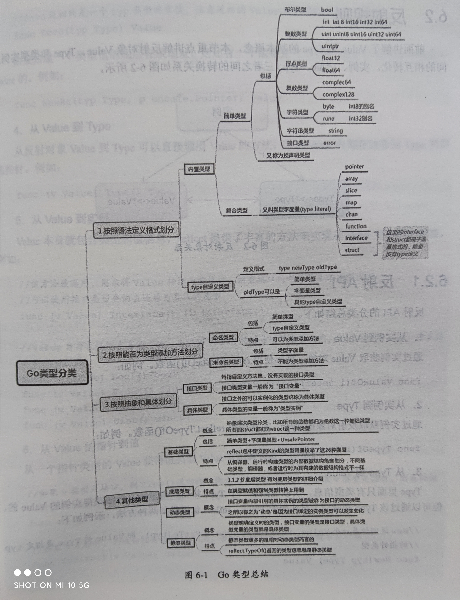

# 反射
反射是为了在系统运行过程中访问、检测、修改自身状态的能力。其实关注的无非就是两点：
+ 类型是什么
+ 存储的值是什么

Go 语言中，编译器和 runtime **将类型信息保存在程序中**，通过 reflect 标准库提供了一套**访问接口**。

## 基本概念
Go 的反射的基础是接口和类型系统。它巧妙的**借助了实例到接口的转换**。具体而言，实例被传递给一个空接口，空接口　**eface 中的　*type 指针**实际上就包含了该实例的全部类型信息。reflect 标准库其实就是在这个数据结构之上进行访问。

### 基本数据结构和 入口函数
#### reflect.Type
类型的公共信息由一个结构　rtype 所描述，实际上和描述接口内部实现的　runtime 包中的　_type 是一个东西。rtype 实现了 Type 接口，通过　reflect.TypeOf() 返回一个 Type 类型的接口。函数原型为`func TypeOf(i interface{}) Type`
> 返回 Type 类型接口而不是 rtype 类型是因为
> 1. 安全起见，rtype 不应当被动态修改，而应该当成只读信息来处理，接口类型 Type 一定程度上阻止了不安全访问
> 2. 除了 rtype，不同类型可能会返回不同的类型定义，需要有一个统一的接口管理。

reflect.Type 接口的主要方法有：`Name, Kind, Implements(u Type), AssignableTo(u Type), Comparable, NumMethod, Method(i), MethodByName(string), PkgPath， Size` 等和类型有关的接口。

不同的基础类有一些专有方法，如
```
Int*, Uint*, Float*, Complex*: Bits
Array: Elem, Len
Chan: ChanDir, Elem
Func: In, NumIn, Out, NumOut, ISVariadic(可变参数)
Map: Key, Elem
Ptr: Elem
Slice: Elem
Struct: Field, FieldByName, FieldByName, FieldByNameFunc, NumField
```

对于 reflect.TypeOf(a)，传入的实参 a 有三种可能：
1. 具体类型变量：返回实例的具体类型信息
2. 未绑定实例的接口变量：返回接口的**静态类型信息（即接口自身的类型信息）**
3. 绑定实例的接口变量：返回接口的**动态类型信息（接口所绑定的实例的类型信息）**

#### reflect.Value
reflect.Value 表示实例的值的信息，它是一个 struct，并提供了一系列访问接口。
```go
type Value struct {
    // type of the value represented by a Value
    typ *rtype
    // 指向值的指针
    ptr unsafe.Pointer
    // flag
    flag
}

func ValueOf(i interface{}) Value
```
可以通过 Value.Type() 获取到 Value 的类型信息，Value.Interface() 将把 Value 的数据当成一个空接口返回。

### 基础类型和底层类型
Type 中的 Kind 方法返回的是整数枚举值，不同的值代表了不同的基础类型。

这里的基础类型没有特别具体，可以看作是一个抽象的概念。比如，所有的　func 无论其签名如何，都是　func。struct 同理。

底层类型是针对每一个具体的类型来定义的，不同 struct 可能会有不同的底层类型。 

```go
type A struct {
    a int
}
type Aa A
type B struct {
    b int
}
```
在这里，A Aa B 的基础类型都是 struct，B 的底层类型是B自身，A 和 Aa 的底层类型都是 A。

### 类型总结


## 反射规则
反射涉及到三个概念：Value、Type、实例。
### 反射　API
1. 从实例到 Value
   
    `func ValueOf(i interface{}) Value`

2. 从实例到 Type

    `func TypeOf(i interface{}) Type`

3. 从Type到 Value

    Type 只有类型信息，可以通过建立一个该 Type 的实例获取其 Value
    
    `func New(typ Type) Value`, Value 的类型为 typ 指针，即 PtrTo(typ)

    `func Zero(typ Type) Type`，返回的是 typ 类型的零值。该 Value 不能寻址，值不可改变。

    若是知道一个类型值的底层存放地址，可以根据 Type 和地址恢复出 Value. `func NewAt(typ Type, p unsafe.Pointer) Value`

4. 从Value 到 Type

    Value 内部就存放着 Type. `func (v Value) Type() Type`

5. 从Value 到实例

    Value 本身就包含了类型信息和值信息。`function（v Valie) Interface() (i interface{})` 返回了 Value 对应实例的空接口，再用接口类型查询即可恢复具体类型。

6. 从 Value 的指针到值
    指针类型的 Value 获得值类型的 Value

    `func (v Value) Elem() Value`， 如果 v的类型是接口，则返回接口绑定的实例的 Value, 如果 v 是指针型 Value，就返回指针值所指地点的 Value.

    ？

7. Type指针和值的相互转换

    指针类型 Type 到值类型 Type
    `t.Elem() Type`

    值类型 Type 到指针类型 Type
    `func PtrTo(t Type) Type`

    ？

8. Value的可修改性
   Value 何时可以修改？实例对象传递给接口的是一个完全的值拷贝，调用反射方法，获得的实际上是 Value 的副本，无法修改。假如穿进去的是一个指针，虽然指针值本身无法修改，但是可以通过指针访问到原始对象进行修改。判断和赋值方法如下。
    + `func (v Value) CanSet() bool`
    + `func (v Value) Set(x Value)`

    ```go
    type User struct {
        Id int
        Name string
        Age int
    }

    func main() {
        u := User{Id: 1, Name:"TDD", Age: 2}

        v := reflect.ValueOf(&u)
        
        name := "CY"
        v_name = reflect.Valueof(name)

        v.Elem().FieldByName("Name").Set(v_name)
        // 此时 u 中的 Name 字段已经变成了 “CY”
    }
    ```

[通过反射动态调用方法](https://blog.csdn.net/weixin_33724059/article/details/93836045?utm_medium=distribute.pc_relevant.none-task-blog-baidujs_title-0&spm=1001.2101.3001.4242)

### 反射三定律
1. 反射可以从接口值获得反射对象，对应上节的 1,2
2. 反射可以从反射对象获得接口值，对应上节的 5
3. 若要修改一个反射对象，则其值必须可以修改，对应上节的 7